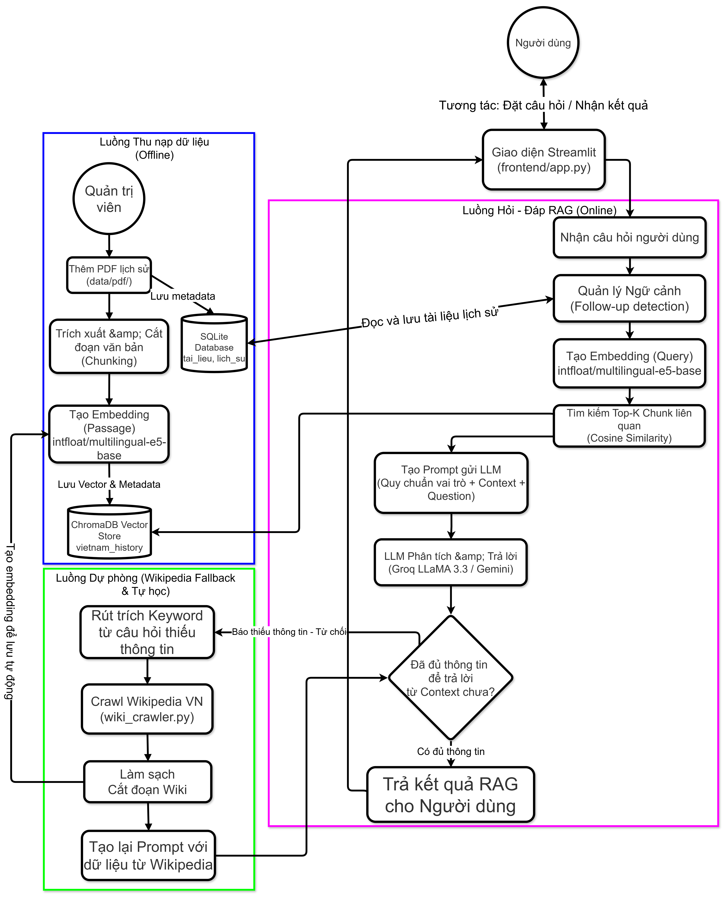
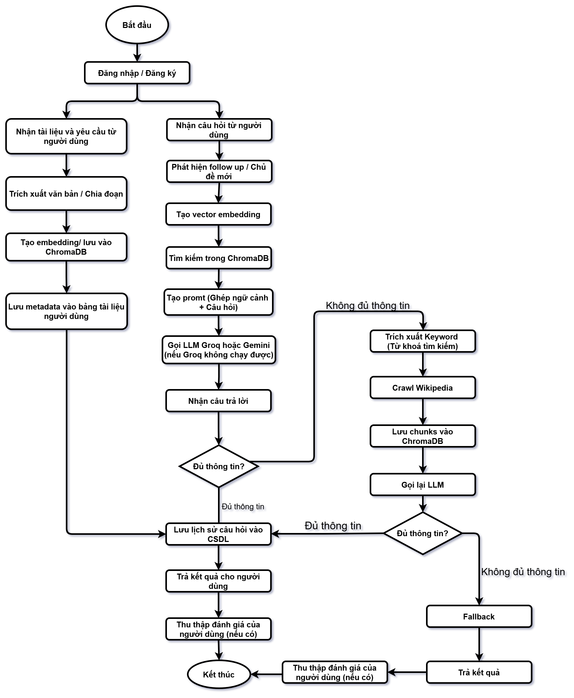
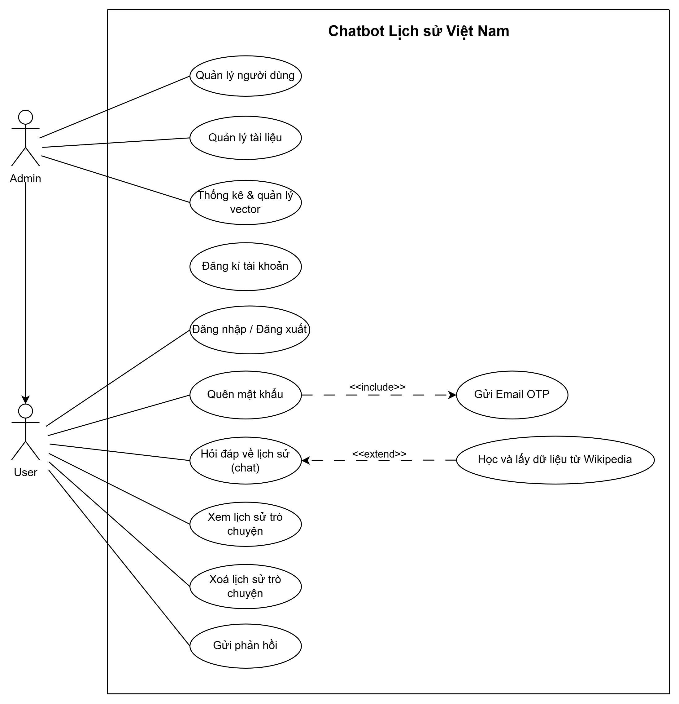
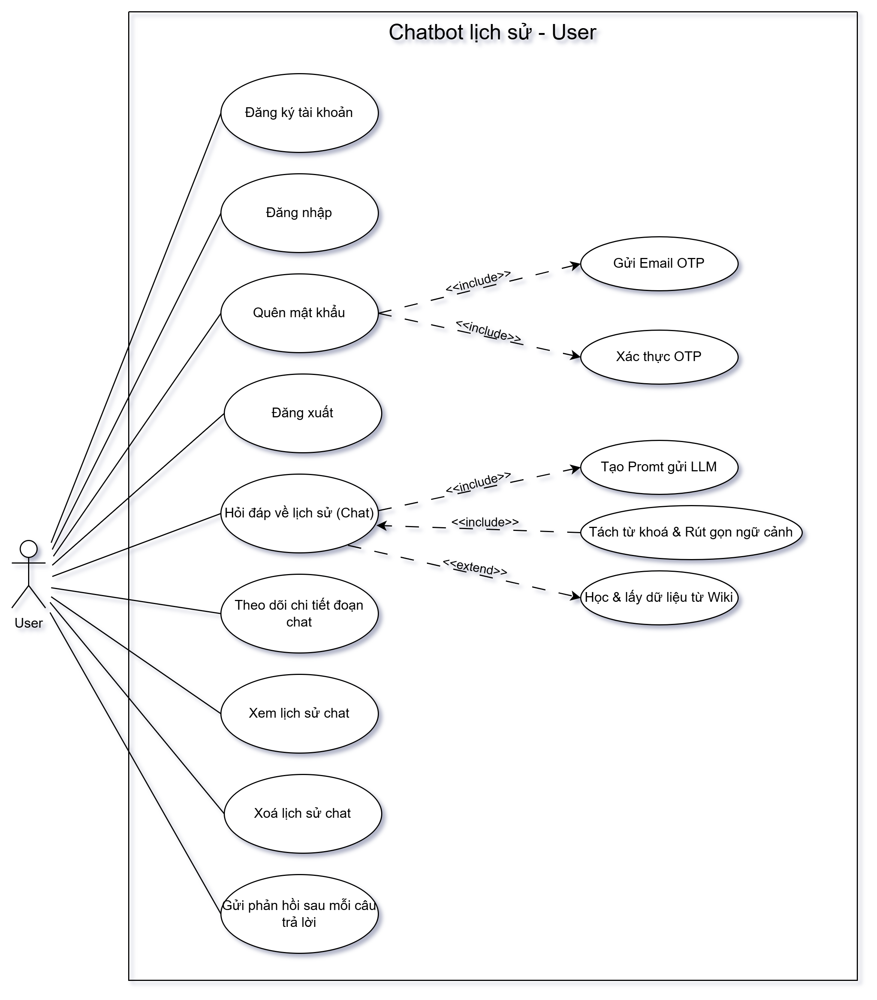
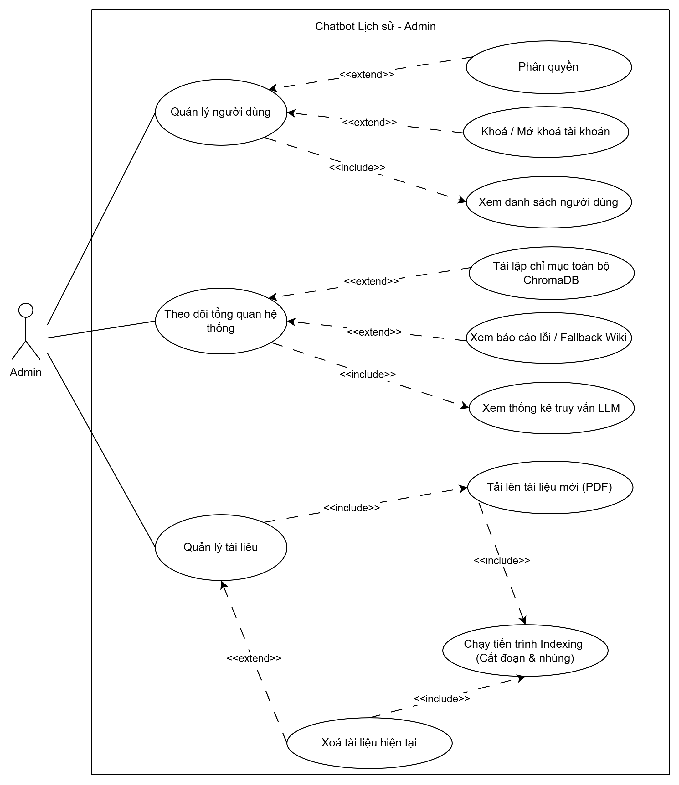
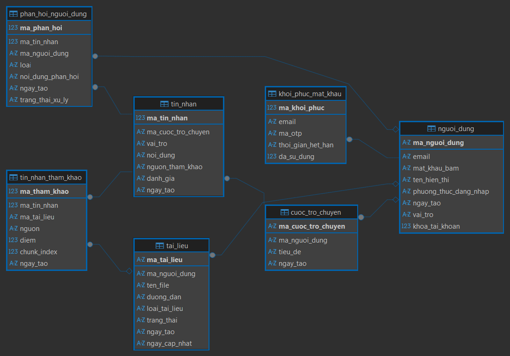
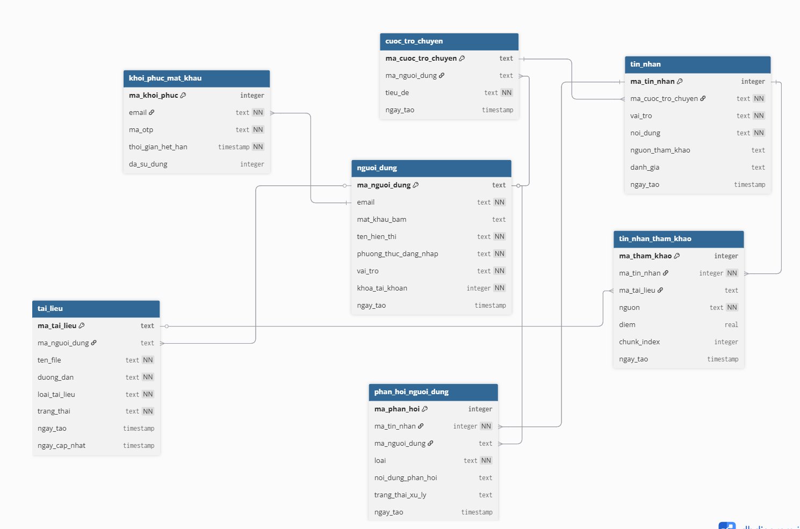

# Chatbot Tra Cứu Lịch Sử Việt Nam

Chatbot hỏi đáp về lịch sử Việt Nam sử dụng kỹ thuật **RAG (Retrieval-Augmented Generation)**. Hệ thống đọc tài liệu PDF, tạo embedding, truy vấn ChromaDB, gọi LLM để trả lời câu hỏi, lưu lịch sử hỏi đáp, và cung cấp giao diện Streamlit hoàn chỉnh cho người dùng.

## Demo trực tuyến

> **Hugging Face Space**: [https://huggingface.co/spaces/NguyenQuocVy2004/chatbot-lichsu](https://huggingface.co/spaces/NguyenQuocVy2004/chatbot-lichsu)
>
> Truy cập link trên để sử dụng chatbot trực tiếp trên trình duyệt mà không cần cài đặt.

---

## Tổng quan

| Thành phần | Chi tiết |
|---|---|
| Bài toán | Chatbot tra cứu lịch sử Việt Nam |
| Giao diện | Streamlit (`frontend/app.py`) |
| Backend chat | `backend/rag_chain_pg.py` |
| API bổ trợ | FastAPI (`backend/api.py`) |
| Vector DB | ChromaDB persistent tại `data/csdl_vector/` |
| Embedding | `intfloat/multilingual-e5-base` |
| LLM chính | Groq `llama-3.3-70b-versatile` |
| LLM dự phòng | Gemini `2.5-flash` → `2.0-flash` → `2.0-flash-lite` |
| CSDL quan hệ | SQLite tại `data/chatbot.db` |
| Nguồn dữ liệu | PDF lịch sử + Wikipedia tiếng Việt (fallback) |

---

## Sơ đồ dự án

### Sơ đồ kiến trúc RAG


### Activity Diagram


### Use Case tổng quát


### Use Case người dùng


### Use Case admin


### Database Diagram


### ERD


---

## Tính năng

### 1. Hỏi đáp RAG

- Nhận câu hỏi từ giao diện hoặc API.
- Phát hiện câu hỏi tiếp nối (follow-up) để giữ context theo session.
- Tìm ngữ cảnh liên quan trong ChromaDB bằng embedding E5.
- Gọi Groq làm LLM chính, tự động fallback sang Gemini khi cần.
- Extractive fallback khi cả hai LLM đều lỗi.
- Bổ sung ngữ cảnh từ Wikipedia khi kho PDF chưa đủ thông tin.

### 2. Quản lý tài liệu PDF

- Upload PDF trực tiếp trên giao diện Streamlit.
- Tóm tắt nhanh nội dung file vừa tải lên.
- Admin có thể thêm/xóa tài liệu hệ thống và tái lập chỉ mục.
- Hỗ trợ index offline từ thư mục `data/pdf/`.

### 3. Quản lý người dùng và phân quyền

- Đăng ký, đăng nhập, đăng xuất.
- Quên mật khẩu qua OTP (gửi Gmail SMTP hoặc hiện OTP để demo).
- Phân quyền `user` / `admin`.
- Admin bootstrap: email admin được cấu hình sẵn trong code hoặc qua biến môi trường `ADMIN_EMAILS`.
- Admin có thể đổi vai trò và khóa/mở khóa tài khoản người dùng.

### 4. Quản lý hội thoại và phản hồi

- Tạo nhiều cuộc trò chuyện, tự động đặt tiêu đề từ câu hỏi đầu tiên.
- Lưu lịch sử hỏi đáp và nguồn tham khảo cho từng câu trả lời.
- Người dùng đánh giá 👍/👎 và gửi phản hồi chi tiết.
- Admin xem lịch sử hỏi đáp toàn hệ thống và quản lý phản hồi.

### 5. Trang quản trị (Admin)

- Quản lý người dùng: xem danh sách, đổi vai trò, khóa/mở khóa.
- Lịch sử hỏi đáp toàn hệ thống.
- Phản hồi người dùng: xem và cập nhật trạng thái xử lý.
- Tài liệu hệ thống: thêm/xóa PDF, tái lập chỉ mục ChromaDB.
- Thống kê RAG: số chunks, collection info.

### 6. API cơ bản

- `GET /` — kiểm tra trạng thái server.
- `POST /chat` — gửi câu hỏi và nhận câu trả lời.
- `POST /clear` — xóa context chat theo `session_id`.

---

## Kiến trúc

```text
Người dùng
   │
   ▼
Streamlit UI (frontend/app.py)
   │
   ├── Auth / Lịch sử / Feedback / Upload PDF / Admin
   │
   ▼
RAG Engine (backend/rag_chain_pg.py)
   │
   ├── Embedding search trong ChromaDB
   ├── Follow-up detection theo session
   ├── Groq → Gemini → Extractive fallback
   ├── Wikipedia fallback khi cần
   │
   ├──▶ SQLite (backend/db.py)
   │      ├── nguoi_dung
   │      ├── cuoc_tro_chuyen
   │      ├── tin_nhan
   │      ├── tai_lieu
   │      ├── phan_hoi_nguoi_dung
   │      └── tin_nhan_tham_khao
   │
   ├──▶ ChromaDB (data/csdl_vector/)
   │
   └──▶ PDF pipeline (data_processing/)
```

---

## Cấu trúc thư mục

```text
chatbot-lichsu/
├── .streamlit/
│   └── config.toml              # Cấu hình Streamlit (theme, upload, XSRF)
├── backend/
│   ├── admin_config.py           # Danh sách email admin bootstrap
│   ├── admin_services.py         # Dịch vụ admin: user, feedback, tài liệu, reindex
│   ├── api.py                    # FastAPI endpoint cơ bản
│   ├── auth.py                   # Đăng ký, đăng nhập, OTP, reset mật khẩu
│   ├── config.py                 # Cấu hình backend (API keys, model)
│   ├── db.py                     # SQLite schema, migration, truy vấn
│   ├── email_service.py          # Gửi OTP qua Gmail SMTP
│   ├── rag_chain_pg.py           # RAG engine chính
│   ├── runtime_paths.py          # Quản lý đường dẫn runtime (local / Space)
│   └── wiki_crawler.py           # Bổ sung dữ liệu từ Wikipedia
├── data/
│   ├── chatbot.db                # SQLite database (runtime)
│   ├── csdl_vector/              # ChromaDB persistent storage
│   ├── pdf/                      # File PDF nguồn
│   └── processed/                # Dữ liệu xử lý trung gian
├── data_processing/
│   ├── chunking.py               # Chia đoạn văn bản
│   ├── dynamic_indexing.py       # Hỗ trợ cập nhật chỉ mục
│   ├── indexing.py               # Tạo/search vector database
│   ├── loader.py                 # Đọc PDF
│   └── run_pipeline.py           # Chạy pipeline index offline
├── frontend/
│   └── app.py                    # Giao diện Streamlit
├── scripts/
│   ├── bootstrap_space_data.py   # Tải dataset runtime cho HF Space
│   ├── export_dataset_bundle.py  # Xuất bundle dữ liệu cho dataset repo
│   └── start_space.py            # Entrypoint cho HF Space
├── Dockerfile                    # Docker build cho HF Space
├── requirements.txt
└── README.md
```

---

## Cơ sở dữ liệu

### SQLite (`data/chatbot.db`)

| Bảng | Mô tả |
|---|---|
| `nguoi_dung` | Thông tin tài khoản, vai trò (`user`/`admin`), trạng thái khóa |
| `khoi_phuc_mat_khau` | OTP đặt lại mật khẩu |
| `cuoc_tro_chuyen` | Metadata mỗi cuộc trò chuyện |
| `tin_nhan` | Nội dung hỏi đáp, nguồn tham khảo, đánh giá |
| `tai_lieu` | Tài liệu người dùng và tài liệu hệ thống |
| `phan_hoi_nguoi_dung` | Đánh giá và nhận xét của người dùng |
| `tin_nhan_tham_khao` | Nguồn tham khảo chuẩn hóa gắn với từng tin nhắn |

### ChromaDB (`data/csdl_vector/`)

| Thuộc tính | Giá trị |
|---|---|
| Collection | `lich_su_viet_nam` |
| Embedding | `intfloat/multilingual-e5-base` |
| Metric | Cosine similarity |

---

## Luồng xử lý chính

### Index tài liệu

```text
PDF → loader.py → chunking.py → indexing.py → ChromaDB
```

### Hỏi đáp

```text
Câu hỏi → ask_pg() → embedding search → tạo prompt → Groq / Gemini → lưu lịch sử + nguồn tham khảo
```

### Fallback

```text
Không đủ thông tin từ PDF → tìm/crawl Wikipedia → thêm ngữ cảnh → sinh câu trả lời mới
```

---

## Cài đặt và chạy (local)

### 1. Cài thư viện

```bash
python -m venv venv
.\venv\Scripts\activate
pip install -r requirements.txt
```

### 2. Tạo file `.env`

```env
GROQ_API_KEY=your_groq_key
GROQ_MODEL=llama-3.3-70b-versatile

GEMINI_API_KEY=your_gemini_key
GEMINI_MODEL=gemini-2.5-flash

SMTP_EMAIL=your_email@gmail.com
SMTP_PASSWORD=your_app_password
```

- `GEMINI_API_KEY` nên có để làm fallback cho Groq.
- `SMTP_EMAIL` và `SMTP_PASSWORD` là tùy chọn, chỉ cần khi muốn gửi OTP qua email.

### 3. Chuẩn bị dữ liệu

Đặt file PDF lịch sử vào `data/pdf/`, sau đó chạy index:

```bash
python data_processing/run_pipeline.py
```

### 4. Chạy giao diện Streamlit

```bash
streamlit run frontend/app.py --server.port 8502
```

Mở trình duyệt tại `http://localhost:8502`.

### 5. Chạy API (tùy chọn)

```bash
python backend/api.py
```

API docs tại `http://localhost:8000/docs`.

---

## Triển khai trên Hugging Face Space

Project đã được triển khai tại: [https://huggingface.co/spaces/NguyenQuocVy2004/chatbot-lichsu](https://huggingface.co/spaces/NguyenQuocVy2004/chatbot-lichsu)

Cấu hình triển khai:

- **SDK**: Docker
- **Entrypoint**: `scripts/start_space.py` → bootstrap dataset → chạy Streamlit trên port 7860
- **Dataset runtime**: tải từ HF Dataset repo qua `scripts/bootstrap_space_data.py`

Biến môi trường cần cấu hình trên Space:

| Biến | Bắt buộc | Mô tả |
|---|---|---|
| `GROQ_API_KEY` | Có | API key Groq |
| `GEMINI_API_KEY` | Có | API key Gemini (fallback) |
| `HF_DATASET_REPO` | Không | Repo chứa dataset runtime |
| `APP_DATA_DIR` | Không | Thư mục dữ liệu (mặc định `/tmp/app_data`) |
| `ADMIN_EMAILS` | Không | Danh sách email admin (phân cách bằng dấu phẩy) |

---

## Công nghệ sử dụng

| Công nghệ | Vai trò |
|---|---|
| Python | Ngôn ngữ chính |
| Streamlit | Giao diện người dùng |
| FastAPI + Uvicorn | API backend |
| ChromaDB | Vector database |
| SQLite | Lưu dữ liệu quan hệ |
| Sentence Transformers | Embedding E5 |
| Groq API | LLM chính |
| Google Gemini API | LLM dự phòng |
| LangChain Text Splitters | Chunking văn bản |
| pypdf | Đọc PDF |
| BeautifulSoup + requests | Crawl / làm sạch Wikipedia |
| Docker | Triển khai trên HF Space |

---

## Tác giả

**Nguyễn Quốc Vỹ**
**MSSV: 226148**

Đồ án 2 — Chatbot Tra cứu Lịch sử Việt Nam.
