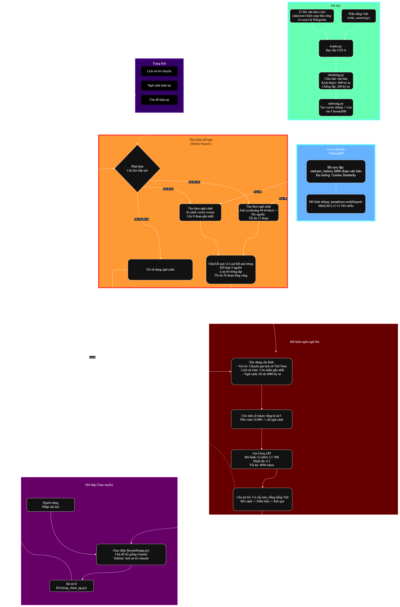

# 🇻🇳 Chatbot Tra Cứu Lịch Sử Việt Nam

Hệ thống chatbot thông minh sử dụng kỹ thuật **RAG (Retrieval-Augmented Generation)** để trả lời các câu hỏi về lịch sử Việt Nam, từ thời cổ đại đến hiện đại.

## 📋 Mục lục

- [Tổng quan](#-tổng-quan)
- [Kiến trúc hệ thống](#-kiến-trúc-hệ-thống)
- [Luồng dữ liệu](#-luồng-dữ-liệu)
- [Cấu trúc thư mục](#-cấu-trúc-thư-mục)
- [Chức năng từng file](#-chức-năng-từng-file)
- [Cơ sở dữ liệu](#-cơ-sở-dữ-liệu-chromadb)
- [Dataset](#-dataset)
- [Cài đặt & Chạy](#-cài-đặt--chạy)
- [Công nghệ sử dụng](#-công-nghệ-sử-dụng)

---

## 🎯 Tổng quan

| Thành phần | Mô tả |
|---|---|
| **Loại ứng dụng** | Chatbot hỏi đáp lịch sử Việt Nam |
| **Kỹ thuật AI** | RAG (Retrieval-Augmented Generation) |
| **Mô hình LLM** | Groq LLaMA 3.3 70B |
| **Vector DB** | ChromaDB (cosine similarity, persistent storage) |
| **Embedding** | Sentence Transformers (`paraphrase-multilingual-MiniLM-L12-v2`, 384 chiều) |
| **Giao diện** | Streamlit (Gemini-style dark theme) |
| **Nguồn dữ liệu** | Wikipedia tiếng Việt + Tài liệu .txt thủ công |

---

## Sơ đồ RAG


### Phân tích luồng hoạt động của sơ đồ

Sơ đồ RAG gồm **6 khối chức năng** chính, hoạt động theo 2 luồng: **Nạp dữ liệu (Offline)** và **Hỏi đáp (Online)**.

#### 🟢 Khối 1: Nạp dữ liệu (màu xanh lá — góc trên phải)

Luồng xử lý dữ liệu đầu vào trước khi chatbot hoạt động:

1. **Nguồn dữ liệu**: 23 file văn bản (`data/raw/`) gồm 9 file biên soạn thủ công + 14 file crawl từ Wikipedia tiếng Việt qua `wiki_crawler.py`
2. **Đọc file**: `loader.py` đọc toàn bộ file `.txt` với encoding UTF-8
3. **Chia nhỏ văn bản**: `chunking.py` chia văn bản dài thành các đoạn nhỏ (chunk_size = 800 ký tự, chồng lấp = 200 ký tự)
4. **Tạo vector nhúng & lưu trữ**: `indexing.py` tạo embedding cho mỗi đoạn và lưu vào ChromaDB

#### 🔵 Khối 2: Cơ sở dữ liệu ChromaDB (màu xanh dương — bên phải)

Nơi lưu trữ và truy vấn dữ liệu vector:

- **Bộ sưu tập**: `vietnam_history` chứa ~5890 đoạn văn bản
- **Đo lường**: Cosine Similarity
- **Mô hình nhúng**: `paraphrase-multilingual-MiniLM-L12-v2` (384 chiều)

#### 🟣 Khối 3: Hỏi đáp — Trực tuyến (màu tím — góc dưới trái)

Luồng bắt đầu khi người dùng tương tác:

1. **Người dùng** nhập câu hỏi
2. **Giao diện Streamlit** (`app.py`) — chủ đề tối kiểu Gemini, có sidebar lịch sử trò chuyện — tiếp nhận câu hỏi
3. **Bộ xử lý RAG** (`rag_chain_pg.py`) nhận câu hỏi và chuyển sang khối Tìm kiếm kết hợp

#### 🟠 Khối 4: Tìm kiếm kết hợp — Hybrid Search (màu cam — trung tâm)

Đây là khối xử lý cốt lõi, quyết định context nào sẽ được gửi cho LLM:

1. **Phát hiện câu hỏi tiếp nối** (hình thoi — điểm quyết định):
   - Nếu là **chủ đề mới** → chạy song song 2 nhánh tìm kiếm:
     - **Tìm theo từ khóa**: ánh xạ ~60 từ khóa → file nguồn chính xác, lấy tối đa 15 đoạn
     - **Tìm theo ngữ nghĩa**: so sánh vector cosine trong ChromaDB, lấy 8 đoạn gần nhất
   - Nếu là **câu hỏi tiếp nối** → tái sử dụng ngữ cảnh cũ từ phiên trước (không tìm kiếm lại)
2. **Gộp kết quả & loại trùng**: kết hợp kết quả từ 2 nguồn, loại bỏ đoạn trùng lặp, giới hạn tối đa 20 đoạn tổng cộng

#### 🔴 Khối 5: Mô hình ngôn ngữ lớn — Groq LLM (màu đỏ đậm — góc dưới phải)

Xử lý sinh câu trả lời từ context đã tìm được:

1. **Xây dựng câu lệnh (prompt)**: gồm vai trò chuyên gia lịch sử Việt Nam + lịch sử chat (2 tin gần nhất) + ngữ cảnh (tối đa 8000 ký tự) + câu hỏi người dùng
2. **Ước tính số token**: ≈ tổng ký tự ÷ 3. Nếu vượt 10.000 token → tự động cắt ngữ cảnh
3. **Gọi Groq API**: mô hình LLaMA 3.3 70B, nhiệt độ 0.3, tối đa 4096 token đầu ra
4. **Câu trả lời**: có cấu trúc, bằng tiếng Việt, theo trình tự Bối cảnh → Diễn biến → Kết quả

#### 🟤 Khối 6: Trạng thái phiên (màu tím đậm — góc trên trái)

Lưu trữ tạm thời để hỗ trợ hội thoại liên tục:

- **Lịch sử trò chuyện**: các cặp hỏi-đáp trước đó
- **Ngữ cảnh hiện tại**: context đã tìm kiếm gần nhất
- **Chủ đề hiện tại**: chủ đề đang được thảo luận

> Trạng thái phiên được **lưu lại** sau mỗi câu trả lời và được **đọc ra** tại bước Phát hiện câu hỏi tiếp nối để quyết định tìm kiếm mới hay tái sử dụng context cũ.

---

## 🏗️ Kiến trúc hệ thống

```
┌─────────────────────────────────────────────────────────────┐
│                    GIAO DIỆN NGƯỜI DÙNG                     │
│                   (Streamlit - app.py)                       │
│             Gemini-style Dark Theme + Sidebar                │
│         Hỗ trợ nhiều cuộc trò chuyện song song              │
└──────────────────────┬──────────────────────────────────────┘
                       │ Câu hỏi người dùng
                       ▼
┌─────────────────────────────────────────────────────────────┐
│                     RAG CHAIN ENGINE                         │
│                   (rag_chain_pg.py)                          │
│                                                              │
│  1. Nhận câu hỏi → Phát hiện follow-up / chủ đề mới        │
│  2. Hybrid search: Keyword mapping + Embedding search        │
│  3. Ghép context + câu hỏi → Gửi đến LLM (Groq)           │
│  4. LLM sinh câu trả lời → Trả về người dùng               │
└──────────┬─────────────────────┬────────────────────────────┘
           │                     │
           ▼                     ▼
┌──────────────────┐  ┌──────────────────────────────────────┐
│   LLM (Groq      │  │           CHROMADB DATABASE           │
│   LLaMA 3.3 70B) │  │          (data/chromadb/)             │
│                   │  │                                       │
│  Sinh câu trả    │  │  • Collection: vietnam_history         │
│  lời từ context  │  │  • Embedding: multilingual-MiniLM     │
│                   │  │  • Similarity: cosine                 │
│                   │  │  • ~5890 chunks                       │
└──────────────────┘  └──────────────────────────────────────┘
                                 ▲
                                 │ Nạp dữ liệu
           ┌─────────────────────┴──────────────────────┐
           │                                             │
┌──────────▼──────────┐              ┌───────────────────▼───┐
│  DATA PROCESSING    │              │   DATA COLLECTION     │
│  (run_pipeline.py)  │              │   (bulk_crawl.py)     │
│                     │              │                       │
│  Đọc file .txt     │              │  Crawl Wikipedia VN   │
│  → Chia chunks     │              │  → Chia chunks        │
│  → Tạo embedding   │              │  → Tạo embedding      │
│  → Lưu ChromaDB   │              │  → Lưu ChromaDB       │
└─────────────────────┘              └───────────────────────┘
```

---

## 🔄 Luồng dữ liệu

### 1. Luồng nạp dữ liệu (Offline)

```
File .txt (data/raw/)          Wikipedia tiếng Việt
        │                              │
        ▼                              ▼
   loader.py                    wiki_crawler.py
   (đọc file)                  (tìm kiếm Wikipedia)
        │                              │
        ▼                              ▼
   chunking.py                  source_manager.py
   (chia nhỏ text,             (quản lý URL đã crawl)
    chunk_size=800,                    │
    overlap=200)                       ▼
        │                      dynamic_indexing.py
        ▼                              │
   indexing.py                         │
        │                              │
        └──────────┬───────────────────┘
                   ▼
              ChromaDB
         (tạo embedding + lưu persistent)
```

### 2. Luồng hỏi đáp (Online)

```
Người dùng nhập câu hỏi
        │
        ▼
   app.py (Streamlit)
        │
        ▼
   rag_chain_pg.py
        │
        ├──► Follow-up detection
        │    → Kiểm tra câu hỏi tiếp nối hay chủ đề mới
        │    → Giữ/xóa context theo session
        │
        ├──► Hybrid Search
        │    ├─ Keyword mapping (KEYWORD_SOURCE_MAP)
        │    │  → Match từ khóa → lấy chunks từ file nguồn
        │    └─ Embedding search (ChromaDB cosine similarity)
        │       → Tìm top_k chunks gần nhất
        │    → Kết hợp kết quả, loại trùng, giới hạn token
        │
        ├──► Groq LLM API (LLaMA 3.3 70B)
        │    → Sinh câu trả lời từ context + câu hỏi
        │    → SYSTEM_PROMPT: chuyên gia lịch sử Việt Nam
        │
        └──► Lưu lịch sử chat theo session
```

---

## 📁 Cấu trúc thư mục

```
DoAn2-ChatbotLichSu/
├── backend/                    # Xử lý logic chính
│   ├── config.py               # Cấu hình API keys
│   ├── db_config.py            # Cấu hình kết nối (legacy)
│   ├── pg_vector_store.py      # Vector store (legacy)
│   ├── rag_chain_pg.py         # RAG Engine chính (ChromaDB + Groq)
│   ├── context_evaluator.py    # Đánh giá chất lượng context
│   └── api.py                  # FastAPI endpoints
│
├── data_collection/            # Thu thập dữ liệu
│   ├── bulk_crawl.py           # Crawl hàng loạt từ Wikipedia
│   ├── wiki_crawler.py         # Tìm kiếm & lấy nội dung Wikipedia
│   ├── web_scraper.py          # Scrape nội dung từ URL bất kỳ
│   ├── google_search.py        # Tìm kiếm Google (bổ sung)
│   └── source_manager.py       # Quản lý nguồn đã crawl
│
├── data_processing/            # Xử lý dữ liệu
│   ├── loader.py               # Đọc file .txt từ data/raw/
│   ├── chunking.py             # Chia văn bản thành chunks (800/200)
│   ├── indexing.py             # Index dữ liệu vào ChromaDB
│   ├── dynamic_indexing.py     # Index realtime (khi crawl mới)
│   └── run_pipeline.py         # Pipeline xử lý tổng hợp
│
├── frontend/                   # Giao diện người dùng
│   └── app.py                  # Streamlit UI (Gemini dark theme)
│
├── data/                       # Dữ liệu
│   ├── raw/                    # 23 file .txt lịch sử Việt Nam
│   ├── processed/              # Dữ liệu đã xử lý (chunks.json)
│   ├── chromadb/               # ChromaDB persistent storage
│   └── crawl_log.json          # Log các URL đã crawl
│
├── evaluation/                 # Đánh giá chất lượng
├── .env                        # Biến môi trường (API keys)
├── requirements.txt            # Thư viện Python
└── README.md                   # Tài liệu này
```

---

## 📝 Chức năng từng file

### 🔧 Backend

| File | Chức năng |
|---|---|
| **`config.py`** | Đọc API keys từ `.env` (GROQ_API_KEY, GEMINI_API_KEY). |
| **`rag_chain_pg.py`** | **RAG Engine chính.** Hybrid search (keyword + embedding) trên ChromaDB → ghép context → gửi Groq LLM → trả câu trả lời. Hỗ trợ follow-up detection, session context, giới hạn token tự động. |
| **`context_evaluator.py`** | Đánh giá xem context tìm được có đủ để trả lời câu hỏi không. |
| **`api.py`** | FastAPI server cung cấp REST API endpoints (`/ask`, `/stats`). |

### 🌐 Data Collection

| File | Chức năng |
|---|---|
| **`bulk_crawl.py`** | Crawl hàng loạt chủ đề lịch sử từ Wikipedia tiếng Việt. |
| **`wiki_crawler.py`** | Tìm kiếm từ khóa trên Wikipedia tiếng Việt bằng API, lấy nội dung toàn bộ bài viết. |
| **`web_scraper.py`** | Scrape nội dung từ URL bất kỳ (BeautifulSoup). |
| **`google_search.py`** | Tìm kiếm Google để bổ sung nguồn dữ liệu. |
| **`source_manager.py`** | Quản lý danh sách URL đã crawl (`crawl_log.json`) để tránh trùng lặp. |

### ⚙️ Data Processing

| File | Chức năng |
|---|---|
| **`loader.py`** | Đọc các file `.txt` từ thư mục `data/raw/`, trích xuất tiêu đề và nội dung. |
| **`chunking.py`** | Chia văn bản dài thành chunks bằng `RecursiveCharacterTextSplitter` (chunk_size=800, overlap=200). |
| **`indexing.py`** | **ChromaDB operations.** Tạo collection, thêm documents với embedding, tìm kiếm cosine similarity, thống kê. |
| **`dynamic_indexing.py`** | Index dữ liệu mới crawl vào ChromaDB ngay lập tức (realtime). |
| **`run_pipeline.py`** | Pipeline tổng hợp: `loader.py` → `chunking.py` → `indexing.py`. |

### 🎨 Frontend

| File | Chức năng |
|---|---|
| **`app.py`** | Giao diện chatbot Streamlit. Gemini-style dark theme (#131314). Sidebar lịch sử trò chuyện, welcome screen, suggestion pills, hỗ trợ nhiều cuộc trò chuyện song song. |

---

## 🗄️ Cơ sở dữ liệu (ChromaDB)

### Tại sao chuyển từ PostgreSQL sang ChromaDB?

| Tiêu chí | PostgreSQL | ChromaDB |
|---|---|---|
| **Cài đặt** | Cần server riêng, cấu hình phức tạp | Không cần server, embedded database |
| **Vector search** | Cần extension pgvector | Tích hợp sẵn, chuyên biệt cho vector |
| **Embedding** | Phải tự tính + lưu thủ công | Tự động tạo embedding khi thêm document |
| **Persistent storage** | Cần PostgreSQL service chạy | Lưu file trực tiếp trên disk |
| **Triển khai** | Cần cài PostgreSQL trên mỗi máy | Chỉ cần `pip install chromadb` |
| **Phụ thuộc** | `psycopg2`, PostgreSQL server | Chỉ `chromadb` package |
| **Hiệu suất nhỏ** | Overhead cho dataset nhỏ | Tối ưu cho dataset vừa & nhỏ |

### Ưu điểm của ChromaDB cho dự án này

1. **Zero-config**: Không cần cài đặt hay cấu hình server database — chạy trực tiếp trong Python process.
2. **Portable**: Toàn bộ data nằm trong thư mục `data/chromadb/`, dễ dàng copy, backup, chia sẻ.
3. **Auto-embedding**: ChromaDB tự động tạo vector embedding khi thêm document, không cần viết code riêng.
4. **Chuyên biệt cho RAG**: Được thiết kế cho Retrieval-Augmented Generation — cosine similarity search nhanh, metadata filtering.
5. **Dễ triển khai**: Sinh viên/người dùng chỉ cần clone repo + `pip install` là chạy được, không cần cài database ngoài.

### Cấu hình ChromaDB

| Thuộc tính | Giá trị |
|---|---|
| **Client** | `PersistentClient` (lưu trên disk) |
| **Đường dẫn** | `data/chromadb/` |
| **Collection** | `vietnam_history` |
| **Embedding model** | `paraphrase-multilingual-MiniLM-L12-v2` |
| **Distance metric** | Cosine similarity |
| **Số chunks hiện tại** | ~5890 chunks |

---

## 📊 Dataset

### Nguồn dữ liệu

Dataset bao gồm **23 file .txt** về lịch sử Việt Nam, chia thành 2 loại:

#### 📄 Tài liệu biên soạn thủ công (9 file)

Các file được viết/biên soạn với nội dung chuyên sâu, có cấu trúc rõ ràng:

| STT | File | Chủ đề | Thời kỳ |
|-----|------|--------|---------|
| 1 | `KHỞI NGHĨA HAI BÀ TRƯNG.txt` | Khởi nghĩa Hai Bà Trưng | 40-43 SCN |
| 2 | `CHIẾN THẮNG BẠCH ĐẰNG NĂM 938.txt` | Trận Bạch Đằng - Ngô Quyền | 938 |
| 3 | `TRIỀU ĐẠI NHÀ LÝ (1009 - 1225).txt` | Triều đại nhà Lý | 1009-1225 |
| 4 | `TRIỀU ĐẠI NHÀ TRẦN (1226 - 1400).txt` | Triều đại nhà Trần | 1226-1400 |
| 5 | `CÁCH MẠNG THÁNG TÁM NĂM 1945.txt` | Cách mạng Tháng Tám | 1945 |
| 6 | `CHIẾN DỊCH ĐIỆN BIÊN PHỦ (1954).txt` | Chiến dịch Điện Biên Phủ | 1954 |
| 7 | `KHÁNG CHIẾN CHỐNG MỸ CỨU NƯỚC (1954 - 1975).txt` | Kháng chiến chống Mỹ | 1954-1975 |
| 8 | `Hà Nội 12 ngày đêm.txt` | Chiến dịch Linebacker II | 1972 |
| 9 | `Thành cổ Quảng Trị và Hiệp định Paris.txt` | 81 ngày đêm Quảng Trị & Hiệp định Paris | 1972-1973 |

#### 🌐 Dữ liệu crawl từ Wikipedia (14 file)

Crawl tự động từ Wikipedia tiếng Việt qua `wiki_crawler.py`:

| STT | File | Chủ đề |
|-----|------|--------|
| 1 | `wiki_Bắc_thuộc.txt` | Thời kỳ Bắc thuộc |
| 2 | `wiki_Cách_mạng_Tháng_Tám.txt` | Cách mạng Tháng Tám (Wikipedia) |
| 3 | `wiki_Chiến_dịch_Biên_giới.txt` | Chiến dịch Biên giới 1950 |
| 4 | `wiki_Chiến_dịch_đánh_Tống_10751076.txt` | Lý Thường Kiệt đánh Tống |
| 5 | `wiki_Chiến_tranh_biên_giới_Việt_Nam__Campuchia.txt` | Chiến tranh biên giới Việt-Campuchia |
| 6 | `wiki_Chiến_tranh_biên_giới_Việt__Trung_1979.txt` | Chiến tranh biên giới phía Bắc 1979 |
| 7 | `wiki_Chiến_tranh_Đông_Dương.txt` | Chiến tranh Đông Dương |
| 8 | `wiki_Chiến_tranh_Việt_Nam.txt` | Chiến tranh Việt Nam |
| 9 | `wiki_Lê_Duẩn.txt` | Tổng Bí thư Lê Duẩn |
| 10 | `wiki_Nhà_Hậu_Lê.txt` | Triều đại nhà Hậu Lê |
| 11 | `wiki_Nhà_Lê_trung_hưng.txt` | Nhà Lê trung hưng |
| 12 | `wiki_Quân_đội_nhân_dân_Việt_Nam.txt` | Quân đội Nhân dân Việt Nam |
| 13 | `wiki_Thời_bao_cấp.txt` | Thời kỳ bao cấp |
| 14 | `wiki_Việt_Nam.txt` | Tổng quan Việt Nam |

### Phạm vi thời gian

```
40 SCN ─────────── 938 ──── 1009-1400 ──── 1428-1789 ──── 1945-1979
  │                  │          │               │              │
Hai Bà          Bạch Đằng   Lý - Trần     Hậu Lê        Kháng chiến
Trưng           Ngô Quyền                  Lê Trung Hưng  Chống Pháp/Mỹ
                                                           Biên giới
```

### Xử lý dữ liệu

| Bước | Công cụ | Chi tiết |
|------|---------|----------|
| **Đọc file** | `loader.py` | Đọc 23 file `.txt` từ `data/raw/`, encoding UTF-8 |
| **Chia chunks** | `chunking.py` | `RecursiveCharacterTextSplitter`, chunk_size=800, overlap=200 |
| **Tạo embedding** | ChromaDB + Sentence Transformers | Model: `paraphrase-multilingual-MiniLM-L12-v2` (384 chiều) |
| **Lưu trữ** | `indexing.py` | ChromaDB persistent storage tại `data/chromadb/` |
| **Kết quả** | | **~5890 chunks** được index |

### Hybrid Search

Hệ thống sử dụng **hybrid search** kết hợp 2 phương pháp:

1. **Keyword Search** (KEYWORD_SOURCE_MAP): Ánh xạ từ khóa → file nguồn chính xác
   - Ví dụ: "điện biên phủ" → `CHIẾN DỊCH ĐIỆN BIÊN PHỦ (1954).txt`
   - Ưu tiên cao hơn, lấy toàn bộ chunks từ file nguồn (tối đa 15 chunks)
2. **Embedding Search** (ChromaDB cosine similarity): Tìm chunks tương đồng ngữ nghĩa
   - Top-k = 8 chunks
   - Bổ sung kết quả khi keyword search không đủ

---

## 🚀 Cài đặt & Chạy

### Yêu cầu

- Python 3.10+
- API Key: Groq (miễn phí tại [console.groq.com](https://console.groq.com))

> **Không cần cài đặt database ngoài** — ChromaDB chạy embedded trong Python.

### Bước 1: Cài đặt thư viện

```bash
git clone <repo-url>
cd DoAn2-ChatbotLichSu
python -m venv venv
.\venv\Scripts\activate      # Windows
pip install -r requirements.txt
```

### Bước 2: Cấu hình `.env`

```env
GROQ_API_KEY=gsk_xxxxxxxxxxxxxxxx
```

### Bước 3: Nạp dữ liệu vào ChromaDB

```bash
# Nạp từ file .txt (data/raw/) → ChromaDB
python data_processing/run_pipeline.py

# (Tùy chọn) Crawl thêm từ Wikipedia
python data_collection/bulk_crawl.py
```

### Bước 4: Chạy chatbot

```bash
streamlit run frontend/app.py --server.port 8502
```

Mở trình duyệt tại **http://localhost:8502**

---

## 🛠️ Công nghệ sử dụng

| Công nghệ | Mục đích |
|---|---|
| **Python 3.10+** | Ngôn ngữ lập trình chính |
| **Streamlit** | Giao diện web chatbot (Gemini dark theme) |
| **ChromaDB** | Vector database (embedded, persistent) |
| **Sentence Transformers** | Tạo vector embedding (`paraphrase-multilingual-MiniLM-L12-v2`) |
| **Groq API** | LLM LLaMA 3.3 70B (sinh câu trả lời) |
| **LangChain** | Text splitting (`RecursiveCharacterTextSplitter`) |
| **Wikipedia API** | Nguồn dữ liệu chính |
| **BeautifulSoup** | Web scraping |
| **python-dotenv** | Quản lý biến môi trường |

---

## 👨‍💻 Tác giả
**Nguyễn Quốc Vỹ**
**MSSV: 226148**

**Đồ án 2** — Chatbot Tra Cứu Lịch Sử Việt Nam
Sử dụng kỹ thuật RAG + ChromaDB + Groq LLM

🇻🇳 *"Dân ta phải biết sử ta, cho tường gốc tích nước nhà Việt Nam"* — Hồ Chí Minh