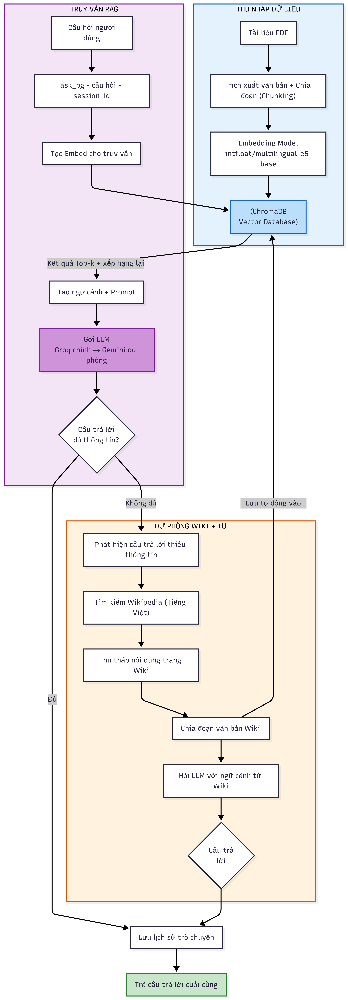
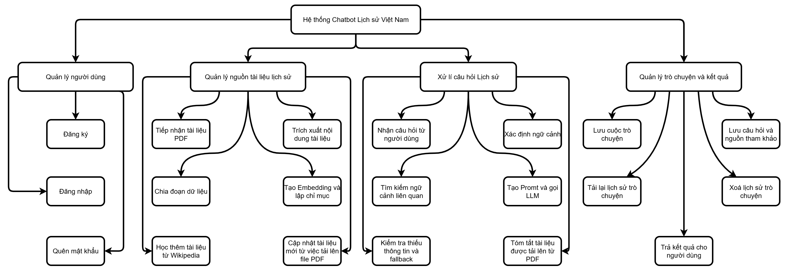
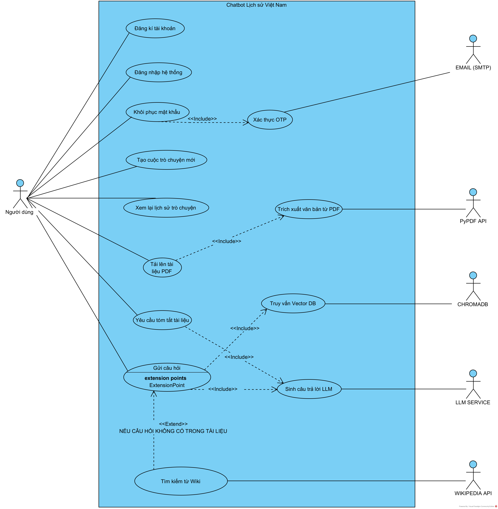

# 🇻🇳 Chatbot Tra Cứu Lịch Sử Việt Nam

Hệ thống chatbot thông minh sử dụng kỹ thuật **RAG (Retrieval-Augmented Generation)** để trả lời các câu hỏi về lịch sử Việt Nam, từ thời cổ đại đến hiện đại.

## 📋 Mục lục

- [Tổng quan](#-tổng-quan)
- [Kiến trúc hệ thống](#-kiến-trúc-hệ-thống)
- [Luồng dữ liệu](#-luồng-dữ-liệu)
- [Cấu trúc thư mục](#-cấu-trúc-thư-mục)
- [Chức năng từng file](#-chức-năng-từng-file)
- [Cơ sở dữ liệu](#-cơ-sở-dữ-liệu-chromadb)
- [Dataset](#-dataset)
- [Cài đặt & Chạy](#-cài-đặt--chạy)
- [Công nghệ sử dụng](#-công-nghệ-sử-dụng)

---

## 🎯 Tổng quan

| Thành phần | Mô tả |
|---|---|
| **Loại ứng dụng** | Chatbot hỏi đáp lịch sử Việt Nam |
| **Kỹ thuật AI** | RAG (Retrieval-Augmented Generation) |
| **Mô hình LLM** | Groq LLaMA 3.3 70B (chính) + Gemini 2.5 Flash (dự phòng) |
| **Vector DB** | ChromaDB (cosine similarity, persistent storage) |
| **Embedding** | Sentence Transformers (`intfloat/multilingual-e5-base`, 768 chiều, prefix query/passage) |
| **Giao diện** | Streamlit (Gemini-style dark theme) |
| **Nguồn dữ liệu** | File PDF về lịch sử Việt Nam + Wikipedia (tự động bổ sung khi thiếu thông tin) |

---
## Sơ đồ RAG Pipeline, BFD và UseCase




### Luồng hoạt động chi tiết

Sơ đồ gồm **3 luồng chính**: Thu nhập dữ liệu (offline), Truy vấn RAG (online), và Dự phòng Wiki + Tự học.

#### 📥 Thu nhập dữ liệu (Offline — khối xanh dương, bên phải)

1. **Tài liệu PDF** — Dữ liệu đầu vào là các file PDF về lịch sử Việt Nam.
2. **Trích xuất văn bản + Chia đoạn (Chunking)** — Đọc text từ PDF, chia thành các đoạn nhỏ (chunk) có overlap để giữ ngữ cảnh liền mạch.
3. **Embedding Model (`intfloat/multilingual-e5-base`)** — Chuyển mỗi chunk thành vector 768 chiều, sử dụng prefix `"passage: "` khi index.
4. **ChromaDB Vector Database** — Lưu trữ toàn bộ vector + metadata (nguồn, thứ tự chunk) vào cơ sở dữ liệu vector, sẵn sàng cho tìm kiếm.

#### 🔍 Truy vấn RAG (Online — khối tím, bên trái)

1. **Câu hỏi người dùng** — Người dùng nhập câu hỏi qua giao diện Streamlit.
2. **`ask_pg(câu hỏi, session_id)`** — Hàm chính xử lý: phát hiện câu hỏi tiếp nối (follow-up) hay chủ đề mới, quản lý phiên hội thoại.
3. **Tạo Embed cho truy vấn** — Câu hỏi được chuyển thành vector (prefix `"query: "`), nếu là follow-up thì kết hợp chủ đề trước + câu hỏi mới.
4. **ChromaDB — Top-k + Xếp hạng lại** — Tìm kiếm các chunk gần nhất bằng cosine similarity, ưu tiên nguồn khớp tên file, xếp hạng lại bằng keyword boosting.
5. **Tạo ngữ cảnh + Prompt** — Ghép các chunk thành context (nhóm theo nguồn, sắp theo thứ tự tài liệu), kèm system prompt hướng dẫn LLM trả lời đúng trọng tâm.
6. **Gọi LLM (Groq chính → Gemini dự phòng)** — Gửi prompt đến Groq (LLaMA 3.3 70B). Nếu Groq hết quota → tự động chuyển sang Gemini (2.5-flash → 2.0-flash → 2.0-flash-lite). Nếu cả hai đều lỗi → extractive fallback (trích xuất câu phù hợp nhất từ context).
7. **Câu trả lời đủ thông tin?** — Kiểm tra câu trả lời có phải dạng "tài liệu không có thông tin" hay không.
     - **Đủ** → Lưu lịch sử trò chuyện → Trả câu trả lời cuối cùng cho người dùng.
     - **Không đủ** → Chuyển sang luồng dự phòng Wikipedia.

#### 🌐 Dự phòng Wikipedia + Tự học (khối cam, phía dưới)

Khi tài liệu PDF không chứa đủ thông tin để trả lời, hệ thống tự động:

1. **Phát hiện câu trả lời thiếu thông tin** — Nhận diện các pattern như "không có thông tin", "tài liệu không đề cập"...
2. **Tìm kiếm Wikipedia (Tiếng Việt)** — Trích xuất keyword từ câu hỏi, gọi API Wikipedia tiếng Việt để tìm bài viết liên quan (`wiki_crawler.py`).
3. **Thu thập nội dung trang Wikipedia** — Crawl nội dung bài Wikipedia, làm sạch HTML, loại bỏ phần không cần thiết.
4. **Chia đoạn văn bản Wikipedia** — Chia nội dung wiki thành các chunk nhỏ (chunk_size=500, overlap=80).
5. **Lưu tự động vào ChromaDB** — Các chunk Wikipedia được lưu vào cùng ChromaDB với metadata `origin: "wikipedia"`. **Đây là cơ chế tự học**: lần sau khi có câu hỏi tương tự, hệ thống sẽ tìm thấy data ngay trong DB mà không cần crawl lại.
6. **Hỏi LLM với ngữ cảnh từ Wikipedia** — Gửi nội dung wiki cho LLM để sinh câu trả lời, kèm ghi chú `(Nguồn: Wikipedia)`.
7. **Câu trả lời Wikipedia tốt?**
     - **Đủ** → Lưu lịch sử → Trả kết quả cuối cùng cho người dùng.
     - **Không đủ** → Trả lời bằng extractive fallback hoặc thông báo không tìm được thông tin.

---

## 🏗️ Kiến trúc hệ thống

```
┌─────────────────────────────────────────────────────────────┐
│                    GIAO DIỆN NGƯỜI DÙNG                     │
│                   (Streamlit - app.py)                       │
│             Gemini-style Dark Theme + Sidebar                │
│         Hỗ trợ nhiều cuộc trò chuyện song song              │
└──────────────────────┬──────────────────────────────────────┘
                       │ Câu hỏi người dùng
                       ▼
┌─────────────────────────────────────────────────────────────┐
│                     RAG CHAIN ENGINE                         │
│                   (rag_chain_pg.py)                          │
│                                                              │
│  1. Nhận câu hỏi → Phát hiện follow-up / chủ đề mới        │
│  2. Embedding search (cosine similarity) trong ChromaDB      │
│  3. Ghép context + câu hỏi → Gửi đến LLM                   │
│  4. LLM sinh câu trả lời → Trả về người dùng               │
│  5. Nếu thiếu thông tin → Wiki Crawler tự động              │
└──────────┬─────────────────────┬────────────────────────────┘
           │                     │
           ▼                     ▼
┌──────────────────┐  ┌──────────────────────────────────────┐
│   LLM PROVIDERS  │  │           CHROMADB DATABASE           │
│                  │  │          (data/chromadb/)             │
│  Groq (chính)    │  │                                       │
│  LLaMA 3.3 70B  │  │  • Collection: vietnam_history         │
│                  │  │  • Embedding: multilingual-e5-base     │
│  Gemini (backup) │  │  • Similarity: cosine                 │
│  2.5-flash/      │  │  • Prefix: query/passage              │
│  2.0-flash/lite  │  └──────────────────────────────────────┘
│                  │             ▲
│  Extractive      │             │ Nạp dữ liệu
│  Fallback (cục   │             │
│  bộ, khi LLM    │  ┌──────────┴────────────────────────────┐
│  không khả dụng) │  │         DATA PROCESSING               │
└──────────────────┘  │        (run_pipeline.py)               │
                      │                                        │
           ┌──────────┤  Đọc file PDF → Chia chunks           │
           │          │  → Tạo embedding → Lưu ChromaDB       │
           │          └────────────────────────────────────────┘
           │
           ▼
┌──────────────────────────────────────┐
│         WIKI CRAWLER                  │
│        (wiki_crawler.py)              │
│                                       │
│  Crawl Wikipedia tiếng Việt           │
│  → Chunk + Lưu vào ChromaDB          │
│  → Cơ chế tự học                      │
└──────────────────────────────────────┘
```

---

## 🔄 Luồng dữ liệu

### 1. Luồng nạp dữ liệu (Offline)

```
File PDF (data/pdf/)
        │
        ▼
   loader.py
   (đọc file PDF bằng pypdf)
        │
        ▼
   chunking.py
   (chia nhỏ text,
    chunk_size=800,
    overlap=200)
        │
        ▼
   indexing.py
   (tạo embedding bằng multilingual-e5-base
    + lưu ChromaDB persistent)
```

### 2. Luồng hỏi đáp (Online)

```
Người dùng nhập câu hỏi
        │
        ▼
   app.py (Streamlit)
        │
        ▼
   rag_chain_pg.py
        │
        ├──► Follow-up detection
        │    → Kiểm tra câu hỏi tiếp nối hay chủ đề mới
        │    → Giữ/xóa context theo session
        │
        ├──► Embedding Search (ChromaDB cosine similarity)
        │    → Source-priority search (ưu tiên nguồn match tên file)
        │    → Keyword boosting (khi không match nguồn)
        │    → Tìm top_k chunks gần nhất, loại trùng, giới hạn token
        │
        ├──► Gọi LLM (Groq → Gemini → Extractive fallback)
        │    → Sinh câu trả lời từ context + câu hỏi
        │    → SYSTEM_PROMPT: chuyên gia lịch sử Việt Nam
        │
        ├──► Auto Wiki Crawl (nếu PDF không đủ thông tin)
        │    → wiki_crawler.py: crawl Wikipedia tiếng Việt
        │    → Lưu chunks mới vào ChromaDB (tự học)
        │    → Hỏi LLM lại với context Wikipedia
        │
        └──► Lưu lịch sử chat theo session
```

---

## 📁 Cấu trúc thư mục

```
DoAn2-ChatbotLichSu/
├── backend/                    # Xử lý logic chính
│   ├── config.py               # Cấu hình API keys (GROQ_API_KEY, NUM_RESULTS)
│   ├── rag_chain_pg.py         # RAG Engine chính (ChromaDB + Groq/Gemini)
│   ├── wiki_crawler.py         # Crawl Wikipedia tiếng Việt + lưu ChromaDB
│   └── api.py                  # FastAPI endpoints
│
├── data_processing/            # Xử lý dữ liệu
│   ├── loader.py               # Đọc file PDF từ data/pdf/
│   ├── chunking.py             # Chia văn bản thành chunks (800/200)
│   ├── indexing.py             # Index dữ liệu vào ChromaDB (E5 embedding)
│   ├── dynamic_indexing.py     # Index PDF mới realtime
│   └── run_pipeline.py         # Pipeline xử lý tổng hợp
│
├── frontend/                   # Giao diện người dùng
│   └── app.py                  # Streamlit UI (Gemini dark theme)
│
├── data/                       # Dữ liệu
│   ├── pdf/                    # File PDF lịch sử Việt Nam
│   ├── processed/              # Dữ liệu đã xử lý (chunks.json)
│   └── chromadb/               # ChromaDB persistent storage
│
├── evaluation/                 # Đánh giá chất lượng
├── docs/                       # Tài liệu, sơ đồ
├── .env                        # Biến môi trường (API keys)
├── requirements.txt            # Thư viện Python
├── debug_context.py            # Script debug context search
├── debug_search.py             # Script debug embedding search
├── test_conversation.py        # Script test hội thoại
└── README.md                   # Tài liệu này
```

---

## 📝 Chức năng từng file

### 🔧 Backend

| File | Chức năng |
|---|---|
| **`config.py`** | Đọc API keys từ `.env` (`GROQ_API_KEY`). Cấu hình `NUM_RESULTS` (số kết quả trả về). |
| **`rag_chain_pg.py`** | **RAG Engine chính.** Embedding search trên ChromaDB → ghép context → gửi LLM (Groq/Gemini) → trả câu trả lời. Hỗ trợ follow-up detection, session context, source-priority search, keyword boosting, extractive fallback, auto Wiki crawl khi PDF thiếu thông tin. |
| **`wiki_crawler.py`** | **Wikipedia Crawler.** Trích xuất keywords từ câu hỏi → tìm kiếm bài Wikipedia tiếng Việt → crawl nội dung → chia chunks (chunk_size=500, overlap=80) → lưu vào ChromaDB. Cơ chế tự học: lần sau không cần crawl lại. |
| **`api.py`** | FastAPI server cung cấp REST API endpoints (`/chat`, `/clear`, `/`). Chạy trên `http://localhost:8000`. |

### ⚙️ Data Processing

| File | Chức năng |
|---|---|
| **`loader.py`** | Đọc các file PDF từ thư mục `data/pdf/` (bao gồm thư mục con) bằng thư viện `pypdf`. |
| **`chunking.py`** | Chia văn bản dài thành chunks bằng `RecursiveCharacterTextSplitter` (chunk_size=800, overlap=200). Lọc chunks quá ngắn (<50 ký tự). |
| **`indexing.py`** | **ChromaDB operations.** Sử dụng model `intfloat/multilingual-e5-base` (768 chiều) với custom `E5EmbeddingFunction` hỗ trợ prefix `"query: "` / `"passage: "`. Tạo collection, thêm documents với embedding, tìm kiếm cosine similarity, thống kê. |
| **`dynamic_indexing.py`** | Index file PDF mới vào ChromaDB ngay lập tức (realtime) mà không cần rebuild toàn bộ. |
| **`run_pipeline.py`** | Pipeline tổng hợp: `loader.py` → `chunking.py` → `indexing.py` → test search. |

### 🎨 Frontend

| File | Chức năng |
|---|---|
| **`app.py`** | Giao diện chatbot Streamlit. Gemini-style dark theme (#131314). Sidebar lịch sử trò chuyện, welcome screen, suggestion pills, hỗ trợ nhiều cuộc trò chuyện song song. |

---

## 🗄️ Cơ sở dữ liệu (ChromaDB)

### Cấu hình ChromaDB

| Thuộc tính | Giá trị |
|---|---|
| **Client** | `PersistentClient` (lưu trên disk) |
| **Đường dẫn** | `data/chromadb/` |
| **Collection** | `vietnam_history` |
| **Embedding model** | `intfloat/multilingual-e5-base` (768 chiều) |
| **Embedding function** | Custom `E5EmbeddingFunction` (prefix `"query: "` / `"passage: "`) |
| **Distance metric** | Cosine similarity |

### Ưu điểm của ChromaDB

1. **Zero-config**: Không cần cài đặt hay cấu hình server database.
2. **Portable**: Toàn bộ data nằm trong thư mục `data/chromadb/`, dễ dàng copy, backup, chia sẻ.
3. **Custom Embedding**: Sử dụng `E5EmbeddingFunction` tự quản lý mode query/passage cho model E5.
4. **Chuyên biệt cho RAG**: Cosine similarity search nhanh, metadata filtering.
5. **Dễ triển khai**: Chỉ cần clone repo + `pip install` là chạy được.

---

## 📊 Dataset


### Nguồn dữ liệu

Dataset sử dụng **file PDF** về lịch sử Việt Nam (thư mục `data/pdf/`) và **Wikipedia tiếng Việt** (tự động bổ sung khi thiếu thông tin).

### Xử lý dữ liệu

| Bước | Công cụ | Chi tiết |
|------|---------|----------|
| **Đọc file** | `loader.py` | Đọc file `.pdf` từ `data/pdf/` bằng `pypdf` |
| **Chia chunks** | `chunking.py` | `RecursiveCharacterTextSplitter`, chunk_size=800, overlap=200 |
| **Tạo embedding** | ChromaDB + Sentence Transformers | Model: `intfloat/multilingual-e5-base` (768 chiều, prefix query/passage) |
| **Lưu trữ** | `indexing.py` | ChromaDB persistent storage tại `data/chromadb/` |

---

## 🚀 Cài đặt & Chạy

### Yêu cầu

- Python 3.10+
- API Key: Groq (miễn phí tại [console.groq.com](https://console.groq.com))
- API Key: Gemini (miễn phí tại [aistudio.google.com](https://aistudio.google.com)) — dùng làm LLM dự phòng

> **Không cần cài đặt database ngoài** — ChromaDB chạy embedded trong Python.

### Bước 1: Cài đặt thư viện

```bash
git clone <repo-url>
cd DoAn2-ChatbotLichSu
python -m venv venv
.\venv\Scripts\activate      # Windows
pip install -r requirements.txt
```

### Bước 2: Cấu hình `.env`

```env
GROQ_API_KEY=gsk_xxxxxxxxxxxxxxxx
GROQ_MODEL=llama-3.3-70b-versatile

GEMINI_API_KEY=AIzaSyxxxxxxxxxxxxxxxxx
GEMINI_MODEL=gemini-2.5-flash
```

> **Lưu ý:** `GEMINI_API_KEY` là tùy chọn nhưng **nên có** để hệ thống tự động chuyển sang Gemini khi Groq hết quota.

### Bước 3: Thêm file PDF

Đặt các file PDF lịch sử Việt Nam vào thư mục `data/pdf/`.

> **Lưu ý:** Khi hệ thống không tìm thấy thông tin trong PDF, dữ liệu Wikipedia sẽ được tự động crawl, chunk và lưu vào ChromaDB cho các lần truy vấn sau.

### Bước 4: Nạp dữ liệu vào ChromaDB

```bash
python data_processing/run_pipeline.py
```

### Bước 5: Chạy chatbot

```bash
streamlit run frontend/app.py --server.port 8502
```

Mở trình duyệt tại **http://localhost:8502**

---

## 🛠️ Công nghệ sử dụng

| Công nghệ | Mục đích |
|---|---|
| **Python 3.10+** | Ngôn ngữ lập trình chính |
| **Streamlit** | Giao diện web chatbot (Gemini dark theme) |
| **ChromaDB** | Vector database (embedded, persistent) |
| **Sentence Transformers** | Tạo vector embedding (`intfloat/multilingual-e5-base`, 768 chiều) |
| **Groq API** | LLM LLaMA 3.3 70B — sinh câu trả lời (provider chính) |
| **Google Gemini API** | LLM dự phòng (2.5-flash → 2.0-flash → 2.0-flash-lite) |
| **LangChain** | Text splitting (`RecursiveCharacterTextSplitter`) |
| **FastAPI + Uvicorn** | REST API server (`/chat`, `/clear`) |
| **pypdf** | Đọc và trích xuất text từ file PDF |
| **Wikipedia API + BeautifulSoup** | Crawl và xử lý nội dung Wikipedia tiếng Việt |
| **python-dotenv** | Quản lý biến môi trường |
| **requests** | HTTP requests cho Wikipedia API |

---

## 👨‍💻 Tác giả
**Nguyễn Quốc Vỹ**
**MSSV: 226148**

**Đồ án 2** — Chatbot Tra Cứu Lịch Sử Việt Nam
Sử dụng kỹ thuật RAG + ChromaDB + Groq/Gemini LLM

🇻🇳 *"Dân ta phải biết sử ta, cho tường gốc tích nước nhà Việt Nam"* — Hồ Chí Minh
